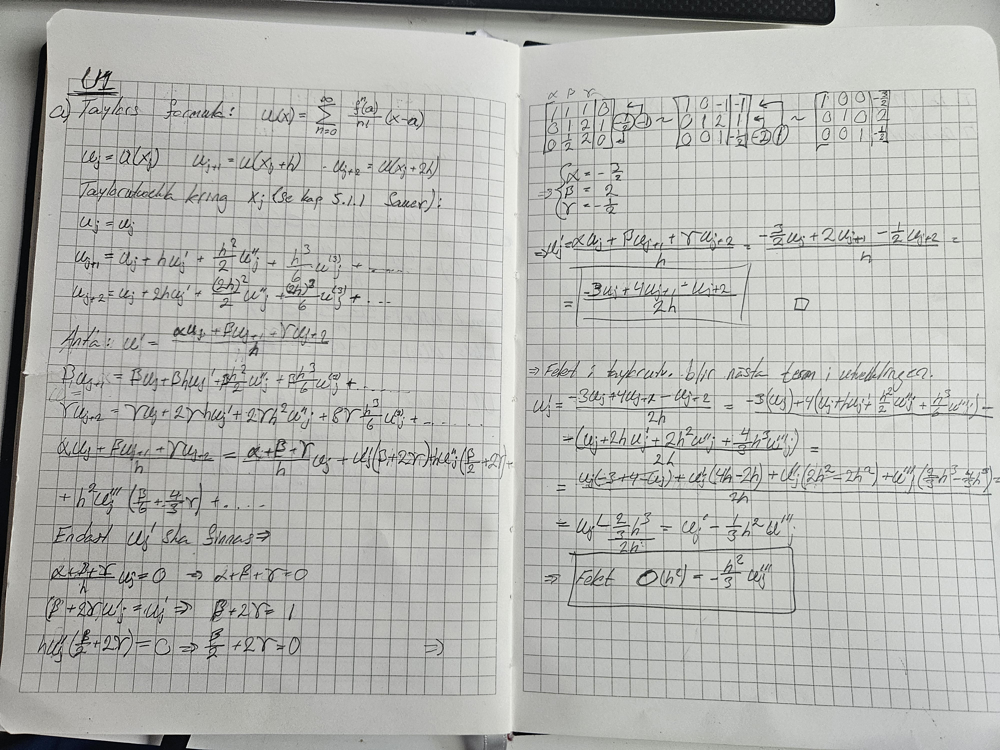
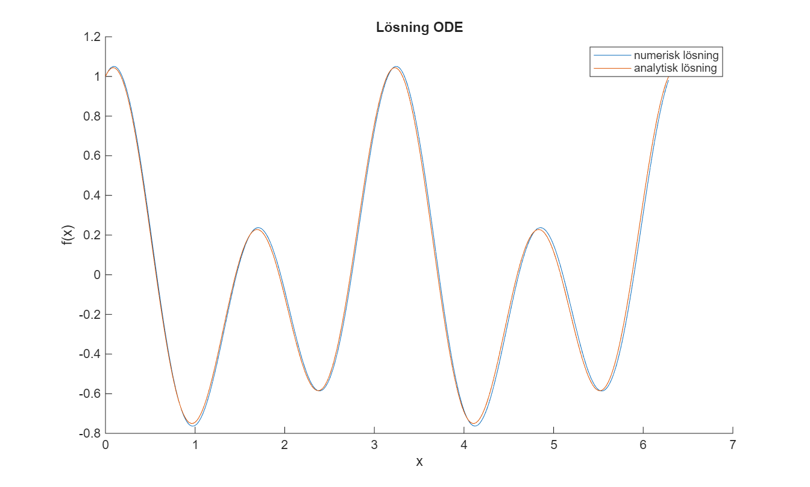
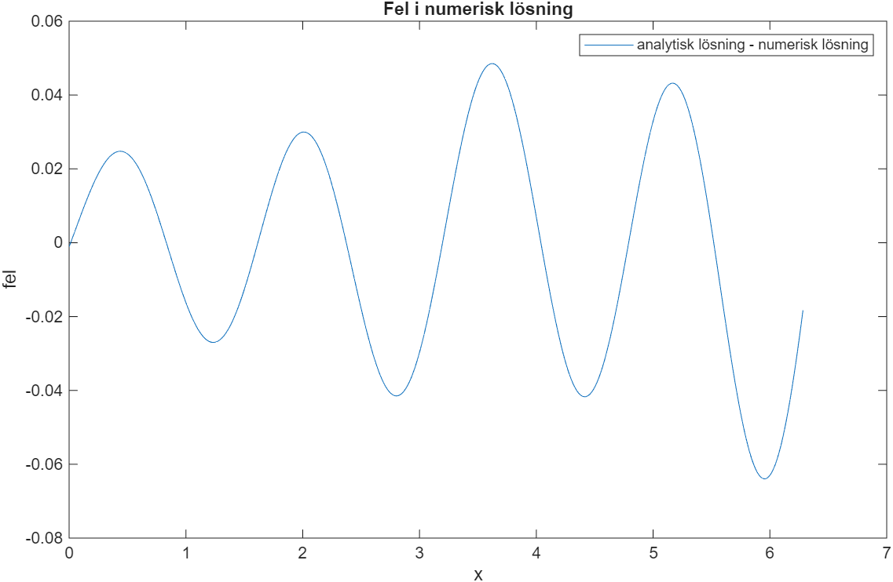
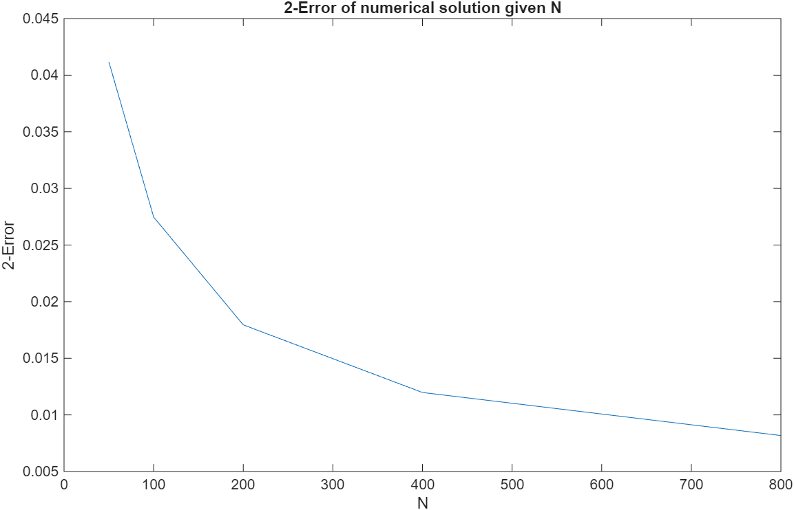
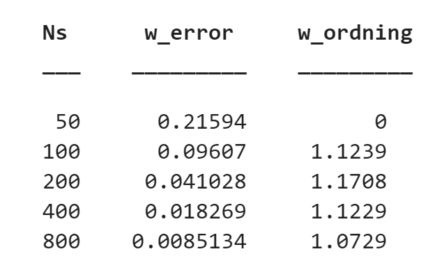

# projekt-2a
KTH SF1682 Projekt 2A
## U1

### a)
The solution to this task can be seen in the image below.

### b)

The absolute error (in the three methods) is compared with the theoretical error O(h^2) in the graph below. It clearly shows that the actual error is the theoretical one, multiplied with some constants. The reason for using a loglog plot is to: [write stuff here!!!].

## U2

### a)

The analytic solution to U2 a) can be seen in the image below.

### b)

The analytic motivation for the transformation from an ODE to a linear equation is motivated in the image below.

### d)

Comparison between the numerical and analytical solution of the ODE as well as the difference between them (error) can be seen in the graphs below.

### e)

The 2 error between for N = [50, 100, 200, 400, 800] can be seen in the graph below.  

The numerical order of this method is 1. When timestep is halfed, so is error. This can be seen in the table below, note that w_ordning = (w_error(last timestep) - w_error(this timestep))/change_in_timestep. Change in timestep is 0,5.

