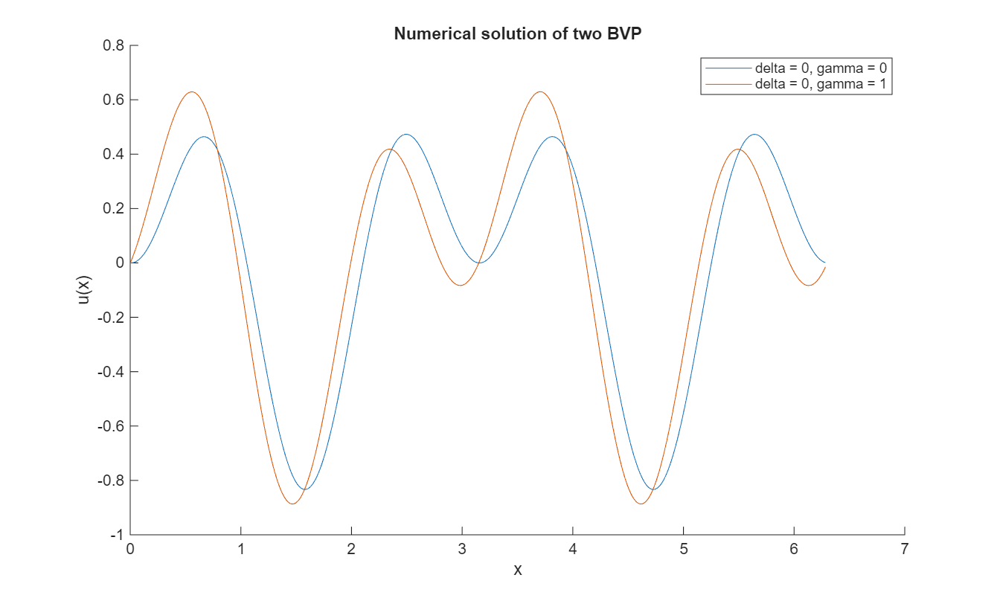

# projekt-2a
KTH SF1682 Projekt 2A
## U1

### a)
The solution to this task can be seen in the image below.

### b)

The absolute error (in the three methods) is compared with the theoretical error O(h^2) in the graph below. It clearly shows that the actual error is the theoretical one, multiplied with some constants. The reason for using a loglog plot is to: [write stuff here!!!].

## U2

### a)

The analytic solution to U2 a) can be seen in the image below.

### b)

The analytic motivation for the transformation from an ODE to a linear equation is motivated in the image below.

### d)  

Comparison between the numerical and analytical solution of the ODE as well as the difference between them (error) can be seen in the graphs below.

### e)  

The 2 error between for N = [50, 100, 200, 400, 800] can be seen in the graph below.  

The numerical order of this method is 1. When timestep is halfed, so is error. This can be seen in the table below, note that w_ordning = (w_error(last timestep) - w_error(this timestep))/change_in_timestep. Change in timestep is 0,5.

### f)  

Changing the f(x) function creates for an entirely new ODE (with many similarities to the old one), and changing the values of delta and gamma changes the path between the first solution and the second one. The second solution ends the solution with a linear slope and the first ends without a slope. This simply changes the BVP. See solutions in the graph below.

## U3

### a)

This is the solution to the heat equation with Euler forward.
.pdf)

### c)

Here we use the same scheme with D = 1, f = 0, TL = TR = 0 and  
u₀(x) = sin(5πx). The plot shows the error u_num − u_exact at T = 0.01,
which is small (about 10⁻⁴) and oscillatory as expected.

.png)

### d)

For the explicit Euler + central difference scheme the stability condition is  
D·Δt/Δx² ≤ 1/2, so the theoretical maximum time step is

Δt_max = Δx² / (2D).

With Δx = 1/N and D = 1 this becomes Δt_max = 1/(2N²), e.g. Δt_max = 5·10⁻⁵ for N = 100.
In our tests Δt ≤ Δt_max gives a stable solution, and decreasing Δt further
makes the numerical error smaller.

